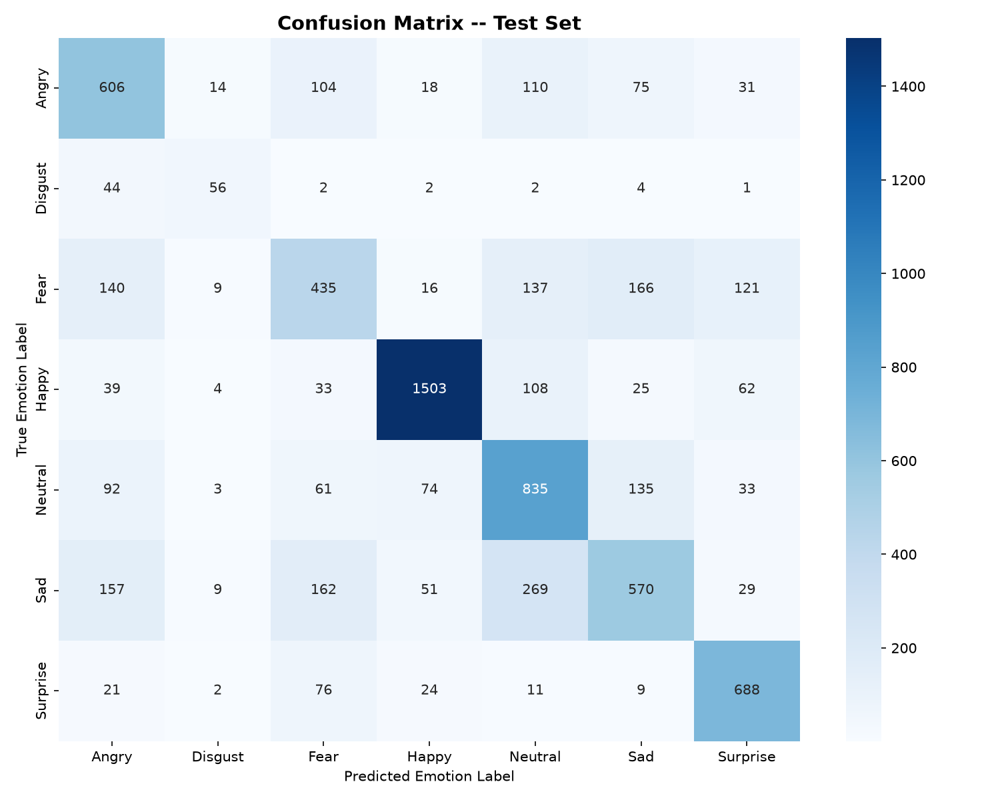
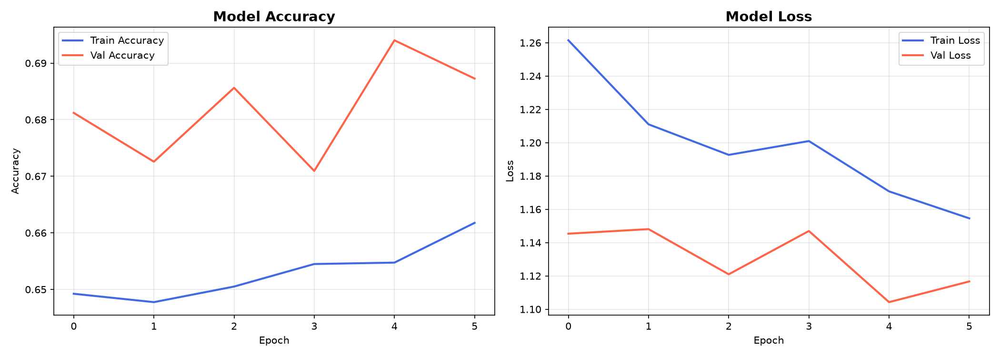
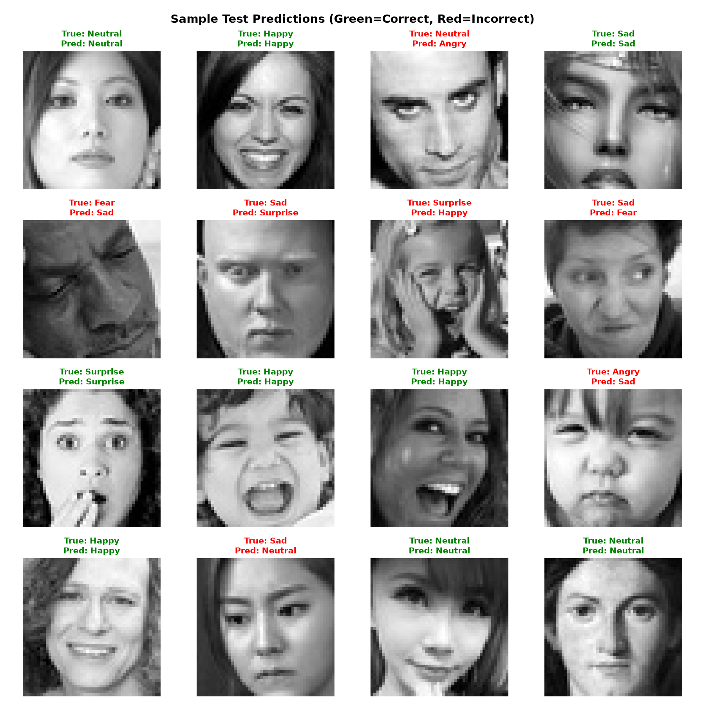

# 🎭 Facial Emotion Recognition AI

[](https://www.python.org/)
[](https://www.tensorflow.org/)
[](https://streamlit.io/)
[](LICENSE)
[](https://github.com/vishal-pal-12)

An end-to-end, production-ready **Deep Learning Facial Emotion Recognition System** powered by a customized 4-block Convolutional Neural Network (CNN) trained on the **FER-2013** dataset. Includes a real-time OpenCV webcam detector, CLI evaluation suite, and a modern **Streamlit Cloud Web Application** for zero-installation access on any device.

---

## 🌟 Key Highlights

- **🧠 Deep CNN Architecture:** 4-Block Conv2D feature extractor with Batch Normalization, Dropout regularization, and Global Average Pooling (`5,089,735` parameters).
- **🎯 7 Emotion Classes:** `Angry`, `Disgust`, `Fear`, `Happy`, `Neutral`, `Sad`, `Surprise`.
- **📈 Verified Model Performance:**
  - **Test Accuracy:** **`65.38%`** (evaluated on all 7,178 untouched test images)
  - **Validation Accuracy:** **`69.40%`**
  - **Weighted F1 Score:** **`65.05%`**
- **⚡ Dual Runtime Compatibility:** Universally compatible across both **Keras 2 (TF <= 2.15)** and **Keras 3 (TF >= 2.16 / Python 3.12)** with automatic deserialization handling.
- **🌐 1-Click Cloud Deployment:** Ready for **Streamlit Community Cloud** with integrated webcam capture, photo upload, and preloaded sample test gallery.

---

## 📊 Evaluation & Performance Metrics

### Confusion Matrix (Test Set: 7,178 samples)


### Training & Validation History


### Sample Predictions


### Per-Class Performance Summary

| Emotion Class | Precision | Recall | F1-Score | Test Support |
| :--- | :---: | :---: | :---: | :---: |
| **Angry** 😠 | 55.14% | 63.26% | 58.92% | 958 |
| **Disgust** 🤢 | 57.73% | 50.45% | 53.85% | 111 |
| **Fear** 😨 | 49.83% | 42.48% | 45.86% | 1,024 |
| **Happy** 😄 | 89.04% | 84.72% | 86.83% | 1,774 |
| **Neutral** 😐 | 56.73% | 67.72% | 61.74% | 1,233 |
| **Sad** 😢 | 57.93% | 45.71% | 51.10% | 1,247 |
| **Surprise** 😲 | 71.30% | 82.79% | 76.61% | 831 |
| **Overall** | **65.43%** (Weighted) | **65.38%** (Accuracy) | **65.05%** (Weighted F1) | **7,178** |

---

## 🏗️ Repository Architecture

```text
Facial-Emotion-Recognition/
├── models/
│   ├── best_model.keras          # Primary trained CNN weights (58.3 MB)
│   └── emotion_cnn_best.keras     # Fallback checkpoint
├── results/
│   ├── confusion_matrix.png      # 7-class evaluation heatmap
│   ├── training_history.png      # Loss & accuracy curves
│   └── sample_predictions.png    # Visual verification grid
├── sample_images/                # Preloaded test gallery for cloud demo
│   ├── happy.jpg, sad.jpg, angry.jpg, surprise.jpg, neutral.jpg, fear.jpg, disgust.jpg
├── utils/
│   ├── __init__.py
│   └── helpers.py                # safe_load_model() & preprocessing
├── app.py                        # Streamlit Cloud interactive web application
├── realtime_detect.py            # OpenCV live webcam detection
├── predict_image.py              # Single-image inference CLI
├── run.py                        # Unified command center (verify/evaluate/predict)
├── train.py                      # CNN architecture & training pipeline
├── requirements.txt              # Cross-platform dependencies
├── packages.txt                  # Linux system packages for Streamlit Cloud
└── README.md
```

---

## 🚀 Quickstart (Local Run)

### 1. Clone the repository
```bash
git clone https://github.com/vishal-pal-12/Facial-Emotion-Recognition.git
cd Facial-Emotion-Recognition
```

### 2. Create and activate a Virtual Environment
```bash
# Windows
python -m venv venv
.\venv\Scripts\activate

# Linux / macOS
python3 -m venv venv
source venv/bin/activate
```

### 3. Install dependencies
```bash
pip install -r requirements.txt
```

### 4. Run the Streamlit Web App locally
```bash
streamlit run app.py
```
> Open your browser at `http://localhost:8501`.

---

## 💻 CLI Commands

### Live Webcam Detection
```bash
python realtime_detect.py
```
* Press **`q`** to quit.
* Press **`s`** to save a screenshot.

### Single Image Prediction
```bash
python predict_image.py --image sample_images/happy.jpg
```

### End-to-End System Verification
```bash
python run.py verify
```

### Model Evaluation on Test Split
```bash
python run.py evaluate
```

---

## ☁️ How to Deploy on Streamlit Community Cloud (Free)

1. Push this repository to your GitHub: `https://github.com/vishal-pal-12/Facial-Emotion-Recognition`.
2. Go to **[share.streamlit.io](https://share.streamlit.io)** and log in with your GitHub account.
3. Click **"New App"** and select:
   - **Repository:** `vishal-pal-12/Facial-Emotion-Recognition`
   - **Branch:** `main`
   - **Main file path:** `app.py`
4. Click **Deploy!** 🚀
5. Within 2 minutes, your live web app URL will be ready to share with anyone in the world!

---

## 👨‍💻 Author

**Vishal Pal**  
GitHub: [@vishal-pal-12](https://github.com/vishal-pal-12)

---

## 📄 License
This project is licensed under the MIT License — see the [LICENSE](LICENSE) file for details.
